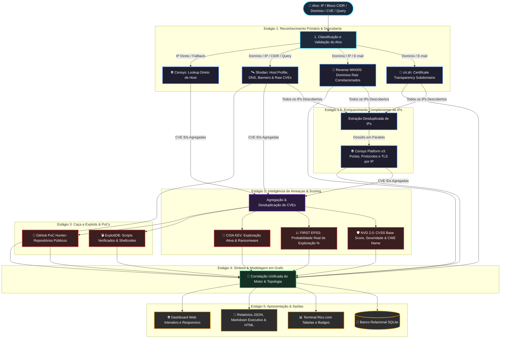

# Conhecendo o DetecTI-CLI: Mapeamento Avançado de Superfície de Ataque e Inteligência de Ameaças em Tempo Real

> *Como transformar dados brutos da internet em inteligência acionável de infraestrutura, vulnerabilidades armadas (PoCs) e risco real com uma engine assíncrona em Python.*
>
> 🌐 **Site Oficial da DetecTI Security:** [detecti.com.br](https://detecti.com.br)

---

## 🎯 Introdução: O Desafio da Superfície de Ataque Exposta

No cenário atual de cibersegurança, as organizações expandem sua presença digital em um ritmo sem precedentes: novos serviços em nuvem, subdomínios temporários, servidores legados esquecidos, APIs expostas e certificados TLS renovados a todo instante. 

Para analistas de **Blue Team**, pesquisadores de **Red Team** e profissionais de **AppSec / Bug Bounty**, surge a pergunta crucial: 
> **"O que os atacantes conseguem enxergar e explorar na minha infraestrutura antes mesmo de eu saber que ela existe?"**

É exatamente para responder a essa pergunta com precisão cirúrgica e alta performance que apresentamos à comunidade o **DetecTI-CLI** (*Cyber Lead Intelligence*), desenvolvido pela [DetecTI Security](https://detecti.com.br).

---

## 🚀 O Que é o DetecTI-CLI?

O **DetecTI-CLI** é uma ferramenta open-source em Python 3.11+ desenvolvida para **Gerenciamento Externo de Superfície de Ataque (EASM - External Attack Surface Management)** e **Inteligência de Vulnerabilidades**.

Em vez de apenas listar portas abertas ou despejar uma lista infinita de CVEs sem contexto, o motor do DetecTI correlaciona entidades em uma **topologia de inteligência estruturada e ancorada no alvo consultado**:

$$\text{Alvo Raiz da Consulta} \xrightarrow{\text{MATCHES\_DOMAIN}} \text{Domínios / Redes (Orgs)} \xrightarrow{\text{HAS\_SUBDOMAIN / CONTAINS\_IP}} \text{Subdomínios / IPs} \xrightarrow{\text{EXPOSES}} \text{Serviços} \xrightarrow{\text{HAS\_VULN}} \text{CVEs} \longrightarrow \text{Exploits}$$

E o mais importante: prioriza o risco real combinando métricas do **NVD (CVSS + CWE)**, probabilidade matemática de exploração com **FIRST EPSS** e verificação de exploração ativa em campanhas reais e ransomware via **CISA KEV**.

---

## 🔄 Como o Motor Funciona: O Fluxo de Dados e Correlação

O motor do DetecTI-CLI opera em um pipeline assíncrono multietapas de alta concorrência (`asyncio` + `httpx`), projetado para orquestrar múltiplas fontes de inteligência de forma inteligente, evitando requisições redundantes e sintetizando os dados em tempo recorde.

### 📊 Diagrama do Pipeline



---

### 🔍 Passo a Passo da Execução:

1. **Classificação Automática do Alvo**:
   O motor identifica nativamente se o alvo fornecido é um endereço IPv4/IPv6, bloco CIDR (`192.168.1.0/24`), Domínio (`exemplo.com.br`), CVE (`CVE-2021-44228`), E-mail de registro ou Query avançada de busca.

2. **Estágio 1 — Reconhecimento Primário & Descoberta**:
   - **Shodan**: Executa consultas de infraestrutura, histórico de DNS do domínio (resolvendo subdomínios para seus IPs `A` record ativos), portas abertas, banners de software e identificadores preliminares de CVE.
   - **crt.sh (Certificate Transparency)**: Minera todos os certificados SSL/TLS públicos emitidos para descobrir subdomínios ativos e domínios corrompidos/legados.
   - **Reverse WHOIS**: Correlaciona outros domínios raiz registrados sob o mesmo CNPJ, e-mail de contato ou razão social da organização.

3. **Estágio 1.5 — Enriquecimento Cruzado via Censys Platform v3**:
   - O motor extrai todos os IPs descobertos na etapa anterior e dispara consultas paralelas no **Censys** para obter dossiês completos de portas, protocolos HTTP/HTTPS, títulos de páginas web, certificados TLS e dados adicionais de serviços. As informações do Shodan e Censys são mescladas sem duplicidades.

4. **Estágio 2 — Inteligência de Vulnerabilidades & Priorização de Risco**:
   - **NVD 2.0 API**: Mapeia pontuações CVSS v3.1/v3.0/v2.0, nível de severidade (*Critical, High, Medium, Low*), descrição técnica e classificação da fraqueza pelo **CWE (Common Weakness Enumeration)**.
   - **FIRST EPSS**: Adiciona a probabilidade percentual (0 a 100%) e percentil de a vulnerabilidade ser ativamente explorada nos próximos 30 dias.
   - **CISA KEV**: Cruza dados com o catálogo oficial da CISA norte-americana para alertar instantaneamente se a falha é usada em campanhas de **ransomware** e ataques ativos.

5. **Estágio 3 — Caça a Provas de Conceito (PoCs) e Exploits**:
   - **ExploitDB (searchsploit local)**: Identifica exploits funcionais, códigos em C/Python/Ruby e status de verificação.
   - **GitHub PoC Hunter**: Localiza repositórios de código aberto no GitHub com PoCs desenvolvidas pela comunidade.

6. **Estágio 4 & 5 — Grafo de Relações, Persistência e Apresentação**:
   - Todo o conhecimento é persistido em um banco de dados relacional **SQLite** dedicado em `./data/dbs/`, exportado em relatórios executivos em **Markdown/JSON/HTML**, exibido em tabelas coloridas no terminal e disponibilizado no **Dashboard Web**.

---

## 💻 Na Prática: Mapeando Alvos pelo Terminal (CLI)

O DetecTI-CLI foi desenhado para ser ágil e intuitivo, operando com comandos simples e suporte a múltiplos formatos.

### 1. Realizando um Scan Completo e Criando a Base SQLite

Para que os dados fiquem salvos e prontos para visualização gráfica posterior, utilizamos a flag `--create-db`:

```bash
# Executa o scan em um domínio e cria o banco em ./data/dbs/empresa.sqlite
./detecti-cli scan -t empresa.com.br --create-db empresa
```

### 2. Mapeamento de Bloco de Rede (CIDR)
```bash
# Varre todo um range IP e salva no banco de dados
./detecti-cli scan -t 200.180.50.0/24 --create-db infra_bloco
```

### 3. Filtro Direto por Severidade CVSS
```bash
# Exibe no terminal apenas ativos contendo vulnerabilidades de severidade CRÍTICA
./detecti-cli scan -t 186.208.48.74 --cvss critical
```

### 4. Consultas Avançadas com Filtros do Shodan
```bash
# Busca por organização específica
./detecti-cli scan -t "org:'Hospital Exemplo'" --create-db hospital

# Busca por serviço específico em uma cidade
./detecti-cli scan -t "city:'Sao Paulo' port:8080" -o markdown -f sp_services.md
```

### 5. Exportando Relatórios Executivos
```bash
# Gera relatório executivo formatado em Markdown para apresentações
./detecti-cli scan -t alvo.com.br -o markdown -f relatorio_auditoria.md

# Gera relatório standalone em HTML pronto para visualização e impressão PDF
./detecti-cli scan -t alvo.com.br -o html -f relatorio_auditoria.html

# Gera exportação estruturada em JSON para pipelines CI/CD
./detecti-cli scan -t alvo.com.br -o json -f dados_brutos.json
```

---

## 🌐 Subindo e Explorando a Interface Web (DetecTI Hound EASM Dashboard)

Após realizar os scans e salvar suas bases SQLite em `./data/dbs/`, você pode inicializar o **DetecTI Hound** (o dashboard gráfico interativo de superfície de ataque) diretamente via CLI com um único comando:

```bash
# 1. Inicia o servidor Web em background (porta padrão: 8000)
# Todas as bases salvas em ./data/dbs/ são selecionáveis diretamente na interface Web
./detecti-cli hound start

# 2. Lista as bases de dados disponíveis salvas
./detecti-cli hound list-dbs

# 3. Verifica o status do servidor
./detecti-cli hound status

# 4. Para o servidor quando concluir a análise
./detecti-cli hound stop
```

Após iniciar, basta abrir o navegador em **`http://127.0.0.1:8000`** para acessar o ambiente visual completo de análise:

<!-- INSERIR PRINT DO DASHBOARD WEB COMPLETO AQUI (VISÃO GERAL DO GRAFO) -->
<!--  -->

### 🌟 Destaques da Interface Gráfica:

1. **🌳 Grafo Hierárquico Multi-Nível Ancorado no Alvo:**
   - O alvo consultado (ex: `alvo.com`, arquivo de lista de alvos, bloco CIDR ou Query do Shodan) é posicionado de forma limpa como o **nó raiz principal (`target_root`)**, ramificando através da árvore completa de FQDNs ($\text{Target} \rightarrow \text{ccTLD/SLD} \rightarrow \text{Apex Domain} \rightarrow \text{Subdomínios} \rightarrow \text{IPs} \rightarrow \text{Serviços} \rightarrow \text{Vulnerabilidades}$). Ao inspecionar uma varredura de arquivo de alvos, o inspetor lista todos os alvos originais em um prático acordeão colapsável.

2. **🖱️ Controles Fluídos do Mouse e Organização Livre de Nós:**
   - **Botão Esquerdo (Arrastar):** Movimenta e faz pan pelo canvas do grafo livremente (cursor com a mãozinha).
   - **Botão Esquerdo (Clique):** Inspeciona o ativo individualmente sem acumular seleções indesejadas.
   - **Botão Direito (Arrastar):** Seleção em caixa retangular para agrupar e reposicionar vários nós juntos.
   - **Botão Direito (Clique Sequencial):** Seleção aditiva para alternar/incluir múltiplos nós um a um.
   - **Scroll do Mouse:** Zoom contínuo e suave focado exatamente no cursor.

3. **📱 Menu Lateral Retrátil em Todas as Telas (Desktop & Mobile):**
   - O botão de hambúrguer (**Filters & Stats**) permite recolher a barra lateral no computador para liberar **100% da tela para o grafo**, ou como gaveta deslizante em tablets e smartphones.

4. **📖 Documentação Oficial Integrada:**
   - Links diretos no cabeçalho e na barra lateral para a [Documentação Oficial](https://detecti.com.br/docs/detecti-cli/index.html) detalhando todo o guia semântico de nós (Target Root roxo elétrico, ASN azul royal, domínios, subdomínios, IPs, serviços, CVEs, KEV), formas geométricas e relacionamentos.

5. **🗄️ Seletor Dinâmico de Bases de Dados:**
   - Alterne instantaneamente entre qualquer base SQLite salva em `./data/dbs/` através do dropdown no cabeçalho, sem precisar reiniciar o servidor web. Acompanha inclusive uma base completa de testes (`example.com.sqlite`) rica em cenários de CISA KEV e PoCs.

6. **🎯 Lead Selector com Isolamento de Ramos:**
   - Permite selecionar hosts ou subdomínios individuais. Ao marcar um lead específico, a interface exibe **apenas a árvore daquele ativo**, subindo até a raiz e descendo para seus serviços e falhas, sem poluir a visão com ramos irmãos não selecionados.

<!-- INSERIR PRINT DO LEAD SELECTOR E FILTROS DE RISCO AQUI -->
<!--  -->

7. **🚨 Filtros de Risco com Aplicação Cumulativa (AND):**
   - Filtre nós combinando critérios cumulativos com isolamento da linha direta de investigação: *CISA KEV (Known Exploited)*, *High EPSS (>50%)*, *Critical Vulnerabilities (CVSS 9.0+)*, *Verified Public PoCs / Exploits* ou *Vulnerable Services Only*. Ao ativar múltiplos filtros, o grafo exibe estritamente a interseção correspondente e poda ramos limpos/irrelevantes.

8. **🔍 Asset Inspector Detalhado:**
   - Clique em qualquer nó para abrir a gaveta lateral contendo metadados completos: IPs, portas, certificados SSL, URLs ativas, descrição técnica CWE, métricas EPSS e links diretos para PoCs no GitHub e ExploitDB.

<!-- INSERIR PRINT DO ASSET INSPECTOR DETALHANDO UMA VULNERABILIDADE AQUI -->
<!--  -->

9. **📥 Exportação Multi-Formato Direto da Web:**
   - Menu *Export Data* no topo para download imediato em **JSON**, **Markdown** ou **HTML** estilizado com botão de impressão em PDF.

10. **🎛️ Modos de Layout e Agrupamento Inteligente (Smart Collapsible Clusters):**
    - **Layouts Especializados:** Selecione entre **Force-Directed** (física orgânica animada), **Hierarchical (Top-Down)** (árvore estruturada de cima para baixo), **Concentric** (órbitas por grau de importância) e **Grid** (matriz uniforme).
    - **Nós Colapsáveis (+15 Serviços / +15 Vulns):** Hosts de alta densidade agrupam seus serviços e CVEs em nós compactos com borda tracejada branca (`[ + 50 Services ]`, `[ + 18 Vulns ]`). Clicar no nó abre o inspetor lateral com as Métricas de Risco agregadas e um botão para descolapsar os filhos localmente em torno do host, sem bagunçar nem recalcular o restante do grafo.

11. **🌐 Acesso Direto ao Site Oficial:**
    - Link direto e integrado no cabeçalho e rodapés para a plataforma oficial da [DetecTI Security (detecti.com.br)](https://detecti.com.br).

---

## 📦 Instalação Rápida

Comece a usar o projeto em poucos passos:

```bash
# 1. Clone o repositório
git clone https://github.com/detectibr/DetecTI-CLI.git
cd DetecTI-CLI

# 2. Crie e ative o ambiente virtual
python3 -m venv venv
source venv/bin/activate

# 3. Instale as dependências
pip install -r requirements.txt
pip install -e .

# 4. Atualize a base de exploits local
chmod +x detecti-cli
./detecti-cli update-xdb

# 5. Verifique suas configurações e chaves de API
./detecti-cli config-check
```

> 💡 *Dica*: O DetecTI-CLI opera nativamente com fallbacks gratuitos para crt.sh, HackerTarget, EPSS, CISA KEV e GitHub PoCs! Para consultas em massa de infraestrutura, basta adicionar suas chaves do **Shodan** e **Censys** no arquivo `.env`.

---

## 🤝 Participe da Comunidade!

O **DetecTI-CLI** é um projeto open-source mantido e desenvolvido para a comunidade de segurança da informação brasileira e global:

- ⭐ **Dê uma estrela no repositório**: Apoie o projeto no GitHub!
- 🐛 **Abra Issues e envie Feedbacks**: Sugira novos coletores ou relate melhorias.
- 🚀 **Envie Pull Requests**: Contribuições de código são muito bem-vindas.

🌐 **Site Oficial**: [https://detecti.com.br](https://detecti.com.br)  
👉 **Repositório Oficial no GitHub**: [https://github.com/detectibr/DetecTI-CLI](https://github.com/detectibr/DetecTI-CLI)  
👨‍💻 **Criador e Mantenedor**: [Lucas S. (Ls4ss)](https://github.com/Ls4ss)

---

*Gostou da ferramenta? Compartilhe este post com seu time de segurança e comece a mapear sua superfície de ataque hoje mesmo!*

