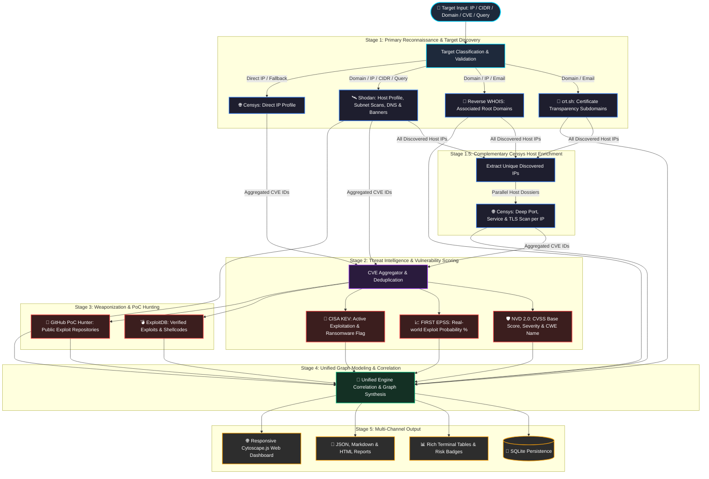

<h1 align="center">DetecTI - Cyber Lead Intelligence</h1>

<div align="center">


### Modern External Attack Surface Mapping & Threat Intelligence Engine
**Asynchronous • Modular • High-Concurrency • EPSS + CISA KEV Prioritization • Shodan • Censys • crt.sh • Reverse WHOIS**

[](https://detecti.com.br)
[](https://detecti.com.br/docs/detecti-cli/en.html)
[](https://www.python.org/downloads/)
[](https://opensource.org/licenses/MIT)
[](https://docs.pydantic.dev/)

</div>

---

## 📚 Official Documentation

> 📖 Complete guides, installation, CLI usage, architecture, and threat intelligence scoring are available in the [**DetecTI-CLI Official Documentation**](https://detecti.com.br/docs/detecti-cli/en.html).

---

## 🚀 Overview

**DetecTI-CLI** is a high-performance Python 3.11+ engine developed by [DetecTI Security](https://detecti.com.br) designed for **External Attack Surface Management (EASM)**, **Asset Reconnaissance**, and **Vulnerability Weaponization Intelligence**.

It maps exposed internet infrastructure (domains, subdomains, IPs, and open services), correlates organizational relationships via **Reverse WHOIS** and **Certificate Transparency**, and enriches identified CVEs with real-world exploitation risk data (**FIRST EPSS + CISA KEV**), weakness taxonomy (**CWE Name**), and public weaponization proofs (**ExploitDB + GitHub PoCs**).

---

## 🔄 Engine Data Flow & Correlation Pipeline

The DetecTI engine executes an asynchronous, multi-stage pipeline designed to discover, correlate, and prioritize internet-facing attack surfaces with threat intelligence feeds.



### 🔍 Step-by-Step Data Flow:

1. **Target Classification**:
   - Categorizes input into `IP`, `CIDR range`, `Domain`, `CVE-ID`, `Email`, `Custom Query`, or `Batch File`.

2. **Stage 1: Primary Reconnaissance & Target Discovery**:
   - **Shodan**: Primary discovery engine for custom queries (e.g., `org:`, `port:`), CIDR subnets (`192.168.1.0/24`), direct IP lookups, and domain DNS record mapping (resolving subdomains to their active `A` record IPs).
   - **Certificate Transparency (crt.sh)**: Discovers all issued TLS/SSL certificates to uncover wildcards and hidden subdomains.
   - **Reverse WHOIS (WhoisFreaks API + HackerTarget fallback)**: Identifies associated parent/child domains registered by the same organization or registrant.
   - **Censys (Direct IP Lookups)**: Queries host profiles for direct single IP targets, or acts as a primary fallback if Shodan is unconfigured.

3. **Stage 1.5: Complementary Censys Host & Service Enrichment**:
   - Once subdomains and resolved IPs are discovered in Stage 1, the engine extracts **all unique discovered IPs**.
   - **Censys** executes parallel host dossiers (`/v3/global/asset/host/{ip}`) on each IP to enrich open ports, web service protocols (`http://` vs `https://`), software versions, TLS certificates, and identify additional CVEs.
   - Port & service data from Shodan and Censys are merged and deduplicated into a single unified host profile.

4. **Stage 2: Threat Intelligence & Vulnerability Prioritization**:
   - All unique CVE IDs identified across Shodan and Censys are aggregated and deduplicated.
   - **NVD 2.0 API**: Retrieves official CVSS v3.1, v3.0, and v2.0 base scores, vector metrics, and **CWE (Common Weakness Enumeration)** weakness name.
   - **FIRST EPSS API**: Appends real-world exploitation probability percentages (0.0% to 100%) and global percentile scores.
   - **CISA KEV Catalog**: Cross-checks vulnerabilities actively leveraged in ransomware and targeted cyber campaigns.

5. **Stage 3: Weaponization & PoC Hunting**:
   - **ExploitDB (searchsploit)**: Matches CVEs against local exploit scripts, PoCs, and shellcodes with verification tags.
   - **GitHub PoC Intelligence**: Queries real-world public exploit repositories, verification status, and stars.

6. **Stage 4: Graph Modeling & Relational Synthesis**:
   - Binds assets into a structured, query-rooted hierarchical topology:
     $$\text{Target Query Root} \xrightarrow{\text{MATCHES\_DOMAIN}} \text{Domains / Org Networks} \xrightarrow{\text{HAS\_SUBDOMAIN / CONTAINS\_IP}} \text{Subdomains / IPs} \xrightarrow{\text{RESOLVES\_TO}} \text{Hosts} \xrightarrow{\text{EXPOSES}} \text{Services} \xrightarrow{\text{HAS\_VULN}} \text{CVEs}$$

7. **Stage 5: Persistence & Presentation**:
   - Automatically stores all relationships in a relational SQLite database.
   - Outputs formatted JSON, Executive Markdown, standalone HTML reports, and interactive web visualization graphs with direct references to [DetecTI Security](https://detecti.com.br).

---

## ⚡ Key Features

- **🌐 Infrastructure & Asset Mapping**:
  - Direct IP, CIDR subnets (`192.168.1.0/24`), Domain, and custom search query support.
  - Port, service, product, version, and banner discovery.
  - Automatic web service URL construction (`http://` vs `https://`).
- **🔍 Subdomain & Domain Correlation**:
  - **Certificate Transparency (crt.sh)** for comprehensive subdomain enumeration.
  - **Reverse WHOIS**: Correlates domains by registrant email, organization name, or domain (WhoisFreaks API + HackerTarget fallback).
  - Shodan DNS historical record mapping.
- **🛡️ Advanced Threat Intelligence & Risk Prioritization**:
  - **NVD 2.0 API**: CVSS base scores, severity levels, and **CWE Name** weakness mapping.
  - **FIRST EPSS**: Exploit Prediction Scoring System (probability percentage & percentile).
  - **CISA KEV**: Catalogs vulnerabilities actively exploited in real-world attacks & ransomware campaigns.
  - **ExploitDB & GitHub PoCs**: Direct links to public exploits and proof-of-concept repositories.
- **💻 Interactive & Fully Responsive Web Dashboard**:
  - Asynchronous FastAPI web server rendering rich EASM network graphs with Cytoscape.js.
  - **Intuitive Mouse Navigation & Node Organization**:
    - **Left-Click (Drag)**: Pan and navigate smoothly across the canvas.
    - **Left-Click (Node)**: Select single node and inspect deep asset metadata in the Asset Inspector.
    - **Ctrl + Left-Click (Node)** / **Cmd + Left-Click**: Additive sequential multi-selection of target nodes.
    - **Right-Click (Node)**: Custom Context Menu to Collapse/Uncollapse Services or Vulnerabilities, Inspect Details, Focus Node, or Copy Domain/IP/CVE identifiers.
    - **Right-Click (Drag)**: Box area selection to group and reposition multiple nodes together.
    - **Smooth Scroll Wheel**: Seamless zoom in/out centered directly at the cursor position.
  - **Retractable Filters & Controls Drawer**: Smoothly collapse the left sidebar to liberate 100% of the screen for graph exploration across all desktop and mobile devices.
  - **Visual Topology & Semantic Relationships**: Interactive graph engine with distinct node geometry, high-contrast colors (Electric Purple root query anchor, Royal Blue ASN octagons, deep blue domains, turquoise subdomains, purple IPs, orange/green service hexagons, red CVE diamonds, and crimson CISA KEV highlights), and directed relationship edges.
  - **Query Target Anchoring**: Graph topology automatically positions the scanned query/target (e.g. `example.com`, CIDR or Shodan query) as the root of all subdomains, IPs, and vulnerabilities.
  - **Dynamic Database Switcher**: Seamlessly switch between any saved SQLite databases without server restart (including a rich pre-packaged demo dataset in `example.com.sqlite`).
  - **Export Data Menu**: One-click download of active scan data in **JSON**, **Executive Markdown**, and **Standalone HTML** formats.
  - **Floating Action Controls**: Instant access to `📐 Fit to Screen`, `🔍 Reset Zoom`, `🔄 Re-layout`, and **Layout Selector** (`🌳 Hierarchical (Top-Down, Default)`, `🌐 Force-Directed`, `🎯 Concentric`, `▦ Grid`).
  - **Smart Collapsible Clusters (High Fan-Out Optimization)**: Group high-density services or vulnerabilities into clean, collapsible cluster nodes with a dashed border. Fully controllable via right-click context menu and side inspector drawer.
  - **Mobile & Tablet Optimized**: Responsive off-canvas navigation drawer with backdrop overlay, touch ergonomics, and debounced canvas resize.
  - **Scoped Lead Selector & Filters**: Visually isolate individual hosts and subtrees without pulling unrelated sibling branches; filter by CISA KEV, High EPSS probability, Critical CVSS, or public PoCs.
  - **Asset Inspector**: Deep-dive into technical properties, CWE descriptions, affected ports, associated domains, and weaponized exploit URLs.
- **📊 Executive & Structured Reporting**:
  - Automated local SQLite database persistence for mapped targets inside `./data/dbs/`.
  - Rich, interactive terminal tables with colored risk badges.
  - Structured **JSON** export (`--format json`).
  - Executive **Markdown** report generation (`--format markdown`) with official DetecTI Security attribution.
  - Standalone, styled **HTML** report generation (`--format html`) with print-to-PDF formatting.


---

## 📦 Installation

### Prerequisites
- Python 3.11 or higher

### Install with pip or editable mode
```bash
git clone https://github.com/detectibr/DetecTI-CLI.git
cd DetecTI-CLI

# Install in editable mode
pip install -e .

# Or install dependencies via requirements.txt
pip install -r requirements.txt

chmod +x detecti-cli

# Install and update Exploit Database
./detecti-cli update-xdb
```

---

## ⚙️ Configuration & API Keys

DetecTI-CLI works out-of-the-box with free fallbacks (crt.sh, HackerTarget, EPSS, CISA KEV, GitHub PoC API), but you can configure API keys for full power:

Create a `.env` file or export environment variables:
```bash
# Required for Shodan queries
export SHODAN_API_KEY="your_shodan_api_key_here"

# Optional: Censys Platform API v3 PAT Token and Org ID
export CENSYS_PAT_TOKEN="your_censys_pat_token_here"
export CENSYS_ORG_ID="your_censys_org_id_here" # (Optional for multi-tenant orgs)

# Optional: Accelerates NVD API rate limits
export NVD_API_KEY="your_nvd_api_key_here"

# Optional: For structured WhoisFreaks reverse WHOIS lookups
export WHOISFREAKS_API_KEY="your_whoisfreaks_api_key_here"

# Optional: GitHub token for PoC queries
export GITHUB_TOKEN="your_github_token_here"
```

You can verify your configuration anytime:
```bash
./detecti-cli config-check
```

---

## 💻 Usage & CLI Examples

### 1. Scan a Single IP or CIDR Subnet
```bash
# Scan single IP
./detecti-cli scan -t 142.250.191.68

# Scan CIDR range
./detecti-cli scan -t 142.250.191.0/24
```

### 2. Scan a Domain (Subdomains + Reverse WHOIS + Infrastructure)
```bash
./detecti-cli scan -t spacex.com
```

### 3. Scan a Specific CVE with EPSS, CISA KEV, and PoCs
```bash
./detecti-cli scan -t CVE-2021-44228
```

### 4. Advanced Shodan Search Queries
You can pass custom Shodan search queries directly into the target `-t` parameter. **Always enclose the query in double quotes ("")**.

```bash
# Search by Organization Name
./detecti-cli scan -t "org:'ACME LTDA'" -m all -f acme.md

# Search by City and Open Service
./detecti-cli scan -t "city:'washington' port:8080" -o markdown -f washington.md

# Search by SSL Certificate Organization
./detecti-cli scan -t "ssl.cert.subject.cn:'SpaceX'"
```
> 💡 **Tip**: Explore all available search filters in the official [Shodan Search Filters Guide](https://www.shodan.io/search/filters).

### 5. Select Specific Modules
```bash
./detecti-cli scan -t example.com -m crtsh,reverse_whois,shodan
```

### 6. Filter Vulnerabilities by CVSS Severity
```bash
./detecti-cli scan -t 142.250.191.68 --cvss critical
```

### 7. Save Scan Results to SQLite Database (EASM Persistence)
To visualize and query the attack surface in the interactive Web Dashboard or preserve scans over time, use `--create-db` to store all correlated data in the central `./data/dbs/` directory:

```bash
# Scan a domain and save to a named database (creates ./data/dbs/spacex.sqlite)
./detecti-cli scan -t spacex.com --create-db spacex

# Scan an IP/network subnet and save to a specific database (creates ./data/dbs/google_net.sqlite)
./detecti-cli scan -t 142.250.191.0/24 --create-db google_net
```
> 💡 All scan databases are centralized in `./data/dbs/` so both the CLI and the Web UI can automatically discover, list, and switch between them.

### 8. Export Reports (JSON, Markdown & HTML)
```bash
# Export Markdown executive report
./detecti-cli scan -t example.com -o markdown -f report.md

# Export standalone styled HTML report
./detecti-cli scan -t example.com -o html -f report.html

# Export JSON structured data
./detecti-cli scan -t example.com -o json -f report.json

# Export all formats to a directory
./detecti-cli scan -t example.com -o all -d ./reports
```

### 9. Update ExploitDB Database
```bash
./detecti-cli update-xdb
```

### 10. Interactive EASM Web Dashboard (DetecTI Hound)
Explore the mapped attack surface visually via the interactive web application from previously saved SQLite databases:

```bash
# Start the DetecTI Hound web dashboard (databases are selected dynamically directly in the Web UI)
./detecti-cli hound start

# List available databases from previous scans (stored in ./data/dbs)
./detecti-cli hound list-dbs

# Check the background server status
./detecti-cli hound status

# Stop the web server
./detecti-cli hound stop
```

#### 🌟 Web Dashboard Highlights:
- **Dynamic Database Switcher**: Switch between any saved SQLite database in `./data/dbs/` directly from the header dropdown without restarting the server.
- **Export Data Menu**: Instant one-click download of the active scan in **JSON**, **Markdown**, or standalone **HTML** format (with built-in print/PDF styling).
- **Interactive Graph Visualization**: Full Cytoscape.js topology with multiple layout algorithms (`⚡ Force-Directed Adv`, `🌳 Hierarchical`, `🎯 Concentric`, `▦ Grid`).
- **Target & Lead Filtering**: Scoped visibility, risk filters (CISA KEV, High EPSS, Critical CVSS, PoCs), and comprehensive technical node inspection.
- **Official Documentation**: Direct integration to the official [DetecTI-CLI Documentation](https://detecti.com.br/docs/detecti-cli/en.html) from the header and sidebar for in-depth architecture guides and interactive visual topology reference.


---

## 🏗️ Architecture

```
DetecTI-CLI/
├── detecti-cli              # Typer & Rich Command Line Interface entrypoint
├── config.py                # Pydantic Settings, .env & Environment Loader
├── data/                    # Central Scan Data Directory
│   └── dbs/                 # Persistent SQLite Attack Surface Databases (.sqlite)
│       └── example.com.sqlite # Default pre-populated enterprise graph & test dataset
├── core/                    
│   ├── engine.py            # Asynchronous Multi-Stage Pipeline & Correlation Engine
│   ├── models.py            # Unified Pydantic v2 Finding, Host & Intel Data Models
│   └── database/            
│       ├── schema.py        # SQLite Relational Schema (Domains, Subdomains, IPs, Services, Vulns, PoCs)
│       └── storage.py       # DatabaseManager Persistence & Query Layer
├── modules/                 # Plug-and-Play Intelligence Collectors
│   ├── base.py              # BaseModule Abstract Interface & Common Methods
│   ├── crtsh.py             # Certificate Transparency Subdomain Enumeration
│   ├── reverse_whois.py     # Reverse WHOIS (Hybrid WhoisFreaks + Free Fallback)
│   ├── shodan.py            # Shodan Host, DNS, Range & Query Scanner
│   ├── censys.py            # Censys Platform API v3 Asset & Host Intelligence (CenQL)
│   ├── nvd.py               # NVD 2.0 (CVSS/CWE) + EPSS Probability + CISA KEV
│   └── exploitdb.py         # ExploitDB (searchsploit) & GitHub PoC Collector
├── reporters/               # Report Generation Subsystem
│   ├── html_reporter.py     # Standalone Styled HTML Exporter (Browser & Print-Ready)
│   ├── json_reporter.py     # Formatted JSON Exporter
│   └── markdown_reporter.py # Executive Markdown Exporter
├── web/                     # Interactive EASM Dashboard Subsystem
│   ├── api/                 
│   │   ├── graph_builder.py # Cytoscape Graph Topology & Target-Root Relationship Builder
│   │   └── routes.py        # FastAPI Endpoints (/databases, /summary, /graph, /assets, /export)
│   ├── static/              
│   │   ├── css/             # Responsive Dashboard Styles (Dark Theme, Drawer, Breakpoints)
│   │   ├── js/              # Cytoscape Graph Engine, Scoped Lead Selector, Filters & Inspector
│   │   └── index.html       # Single Page Application UI
│   ├── process_manager.py   # Background Daemon Server Manager (PID/Status control)
│   └── server.py            # Asynchronous FastAPI & Uvicorn Server
├── utils/                   
│   ├── http.py              # Centralized Async HTTPX Client (Retries, Limits & Headers)
│   └── logger.py            # Rich Console Theme, Colored Risk Badges & Tables
├── tests/                   # Pytest Unit & Integration Test Suite
└── pyproject.toml           # Modern Packaging & Dependency Definition
```

---

## 🧪 Testing

Run the test suite with `pytest`:
```bash
pytest -v
```

---

## 🛠️ Creator and Maintainer

<a href="https://github.com/Ls4ss">
  
  <br />
  <sub><b>Lucas S. (Ls4ss)</b></sub>
</a>
<br />
<sub>Developed for <b><a href="https://detecti.com.br" target="_blank">DetecTI Security</a></b></sub>

Feel free to open Issues or submit Pull Requests to contribute!
